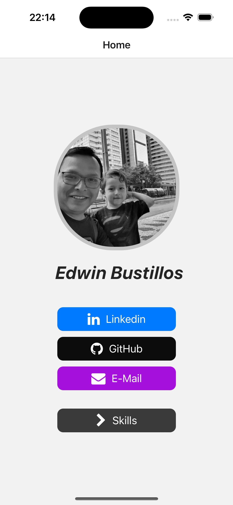
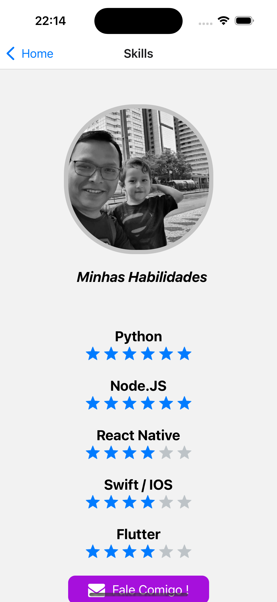
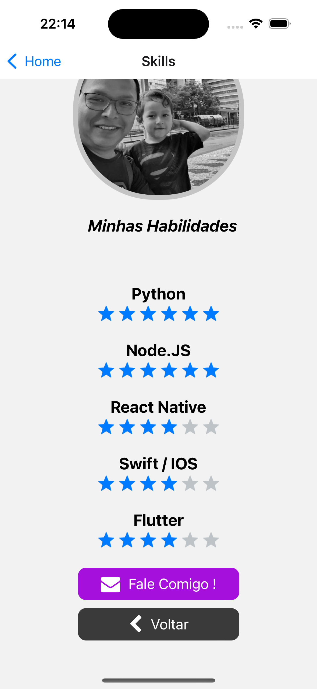

# Projeto App-Card

Este projeto é um aplicativo de cartão de visita desenvolvido com React Native e Expo. Ele permite que os usuários visualizem um perfil com uma foto, um campo de texto e links para as redes sociais LinkedIn, GitHub e e-mail.

### Screenshots

## Funcionalidades

- Exibe uma foto de perfil em formato circular com borda.
- Exibe um campo de texto estático centralizado abaixo da foto.
- Exibe botões de link para LinkedIn, GitHub e e-mail abaixo do campo de texto.
- Os botões de link são estilizados com ícones das respectivas redes sociais.

## Tecnologias Utilizadas

- React Native
- Expo
- React Navigation
- RNEUI

## Como usar

1. Clone este repositório para a sua máquina local usando `git clone https://github.com/edwinbustillos/app_card_react_native.git`.
2. Navegue até a pasta do projeto em seu terminal.
3. Execute `npm install` ou `yarn install` para instalar as dependências do projeto.
4. Execute `npm start` ou `yarn start` para iniciar o servidor de desenvolvimento.
5. Abra o aplicativo Expo em seu dispositivo móvel e escaneie o código QR exibido no terminal ou na página da web que foi aberta.

## Scripts Disponíveis

- `npm start` ou `yarn start`: Inicia o servidor de desenvolvimento.
- `npm run android` ou `yarn android`: Inicia o servidor de desenvolvimento e abre o aplicativo no emulador Android.
- `npm run ios` ou `yarn ios`: Inicia o servidor de desenvolvimento e abre o aplicativo no emulador iOS.
- `npm run web` ou `yarn web`: Inicia o servidor de desenvolvimento e abre o aplicativo no navegador.

## Contribuindo

Contribuições são sempre bem-vindas! Por favor, leia as diretrizes de contribuição primeiro.

## Contato

Se você tiver alguma dúvida, sinta-se à vontade para entrar em contato. Você pode me encontrar no LinkedIn e no GitHub através dos botões de link no aplicativo.